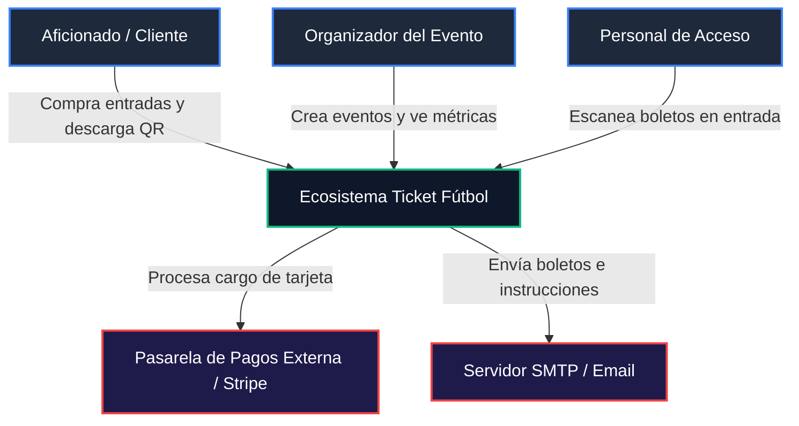
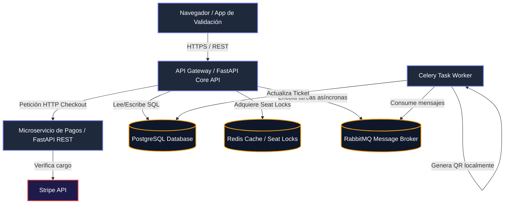
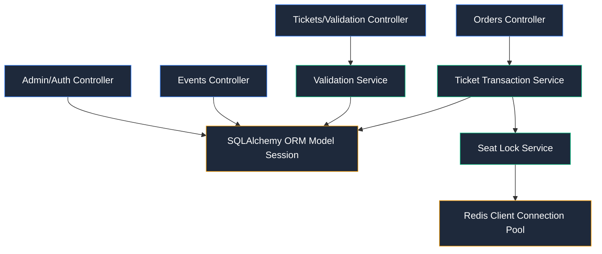
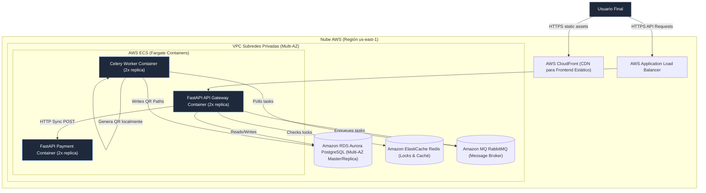

# ⚽ Ticket Fútbol - Plataforma de Boletería Deportiva

Ticket Fútbol es una solución transaccional premium para la venta y control de acceso a partidos de fútbol, diseñada con una arquitectura moderna de microservicios, procesamiento de colas asíncronas con **RabbitMQ**, caché distribuida y locks distribuidos con **Redis**, y un microservicio independiente de pagos (`ticket_payment_service`) comunicado vía HTTP REST.

> [!NOTE]
> ### 📋 Resumen del Proyecto y Ejecución Rápida
> 
> **¿De qué se trata?**  
> Es una plataforma web transaccional para la compra de boletos deportivos y validación de accesos en estadios mediante escaneo de códigos QR en tiempo real con la cámara del celular. Implementa locks distribuidos en memoria para prevenir la "doble venta" de asientos en partidos de alta concurrencia.
> 
> **¿Qué componentes contiene?**  
> * **ticket_api_gateway** (FastAPI, Puerto 8000): Gateway y portal principal.
> * **ticket_payment_service** (FastAPI, Puerto 8001): Microservicio de cobros con panel de telemetría en tiempo real.
> * **ticket_celery_worker** (Celery): Procesador de colas para generar códigos QR.
> * **ticket_rabbitmq**: Bróker de mensajería asíncrona.
> * **ticket_redis**: Base de datos in-memory para cierres (locks) y caché.
> * **ticket_db** (PostgreSQL 15): Base de datos persistente transaccional.
> 
> **¿Cómo correr el proyecto?**  
> Levanta todo el ecosistema de microservicios en segundo plano con un solo comando:
> ```bash
> docker compose -f docker/docker-compose.yml up --build -d
> ```
> * **Acceso Portal Web**: [http://localhost:8000/](http://localhost:8000/)
> * **Swagger API Gateway**: [http://localhost:8000/docs](http://localhost:8000/docs)
> * **Monitoreo de Pagos**: [http://localhost:8001/docs](http://localhost:8001/docs)

---

## 🌟 Características Clave

* **Próximos Eventos (Mundial 2026)**: Vista cliente precargada con partidos mundialistas icónicos (Argentina vs Francia, Brasil vs Alemania, España vs Italia) y selección dinámica de asientos en estadio elíptico.
* **Control de Acceso con Cámara**: Escáner en tiempo real integrado para el Personal de Acceso (Staff). Lee códigos QR directamente usando la cámara del celular y valida la autenticidad al instante.
* **Limpiador de UUID Inteligente**: Si se copia el enlace completo del boleto (`/t/uuid`), el escáner extrae el UUID de manera automática para evitar errores humanos.
* **Historial y Gestión de Eventos**: Panel para Organizadores (Admin) para ver todos los partidos creados, editarlos, eliminarlos en cascada, o alternar su visibilidad (Visible/Oculto) para los clientes.
* **Simulador de Roles**: Selector superior dinámico que permite a la cuenta `admin` alternar su rol simulado en tiempo real entre Organizador y Staff.
* **Auto-Limpieza de Bloqueos**: Mecanismo de auto-liberación que limpia automáticamente asientos cuyo bloqueo de 5 minutos haya expirado en Redis al cargar la administración o partidos.

---

## 🏗️ 1. Diagramas de Arquitectura (Modelo C4)

### C1: Diagrama de Contexto del Sistema

Representa el ecosistema a alto nivel, los usuarios que interactúan y los sistemas externos.



---

### C2: Diagrama de Contenedores (Ecosistema de Microservicios)

Muestra la subdivisión de las aplicaciones que integran el ecosistema, sus bases de datos y cómo interactúan.



---

### C3: Diagrama de Componentes (Para API Core)

Muestra la estructura interna de módulos lógicos dentro de la aplicación FastAPI.



---

### C4: Diagrama de Despliegue e Infraestructura (Producción AWS)

Describe la topología de la nube propuesta para desplegar el sistema con alta disponibilidad.



---

## 🛠️ Stack Tecnológico

1. **API Gateway & Router**: FastAPI (Python 3.10) + Uvicorn.
2. **Base de Datos**: PostgreSQL 15 (Eventos, Usuarios, Órdenes, Asientos y Boletos).
3. **Caché y Locks**: Redis 7 (Límites transaccionales con Locks distribuidos en memoria).
4. **Bróker de Mensajería (Cola)**: RabbitMQ 3 (Gestión de tareas de Celery).
5. **Procesador de Tareas**: Celery Worker (Generación diferida de imágenes QR en proceso con `qrcode`).
6. **Microservicio de Pagos (Payment REST API)**: FastAPI en puerto 8001 que simula cobros de tarjetas y expone un panel de telemetría de red interactivo.
7. **Frontend**: Dashboard con estilo glassmorphism (HTML5/Jinja2/Vanilla CSS/JS) y librerías HTML5-QRCode.

---

## 🚀 Cómo Correr el Proyecto en tu Computadora

### Requisitos Previos

Tener instalados **Docker** y **Docker Compose** en tu sistema.

### Instrucciones de Despliegue Rápido

1. Descarga o clona el proyecto e ingresa a la carpeta raíz.
2. Construye e inicia todos los contenedores en segundo plano:
   ```bash
   docker compose -f docker/docker-compose.yml up --build -d
   ```
3. Verifica que todos los servicios estén activos y saludables:
   ```bash
   docker compose -f docker/docker-compose.yml ps
   ```
4. Abre los siguientes enlaces en tu navegador:
   * **Portal de Boletería y Administración**: [http://localhost:8000/](http://localhost:8000/)
   * **Documentación Interactiva (Swagger API Gateway)**: [http://localhost:8000/docs](http://localhost:8000/docs)
   * **Panel y Swagger del Microservicio de Pagos**: [http://localhost:8001/docs](http://localhost:8001/docs)
   * **Consola de Administración de RabbitMQ**: [http://localhost:15672/](http://localhost:15672/) (Usuario: `guest` / Contraseña: `guest`)

---

## 📄 2. Contratos y Documentación de APIs principales

El API se expone con una documentación interactiva Swagger disponible en `/docs`. Los contratos REST principales son:

### 1. Obtener Token de Acceso (OAuth2)

* **Ruta**: `/token`
* **Método**: `POST`
* **Cuerpo (Form-data)**:
  - `username`: Correo del usuario (email).
  - `password`: Contraseña.
* **Respuesta (200 OK)**:
  ```json
  {
    "access_token": "eyJhbGciOiJIUzI1NiIsInR5cCI6IkpXVCJ9...",
    "token_type": "bearer",
    "role": "admin"
  }
  ```

### 2. Crear Evento Deportivo (Admin)

* **Ruta**: `/events`
* **Método**: `POST`
* **Cabecera**: `Authorization: Bearer <JWT_TOKEN>`
* **Cuerpo (JSON)**:
  ```json
  {
    "title": "Liga de Quito vs Barcelona SC",
    "description": "Final de la Liga Pro",
    "date": "2026-07-20T19:00:00",
    "location": "Estadio Rodrigo Paz Delgado",
    "ticket_price": 25.0,
    "total_seats": 50
  }
  ```
* **Respuesta (201 Created)**: Crea el evento y genera automáticamente los 50 asientos en la base de datos (Ej: A1, A2... E10).

### 3. Crear Órdenes (Lock en Redis)

* **Ruta**: `/orders`
* **Método**: `POST`
* **Cabecera**: `Authorization: Bearer <JWT_TOKEN>`
* **Cuerpo (JSON)**:
  ```json
  {
    "event_id": 1,
    "seat_ids": [12, 13]
  }
  ```
* **Comportamiento**: Llama al `SeatLockService` que ejecuta un `SETNX` en Redis para cada asiento por un TTL de 300 segundos. Si tiene éxito, crea la orden en estado `PENDING` y cambia el estado en DB a `LOCKED`.

### 4. Completar Pago de Orden (Checkout e inyección en RabbitMQ)

* **Ruta**: `/orders/{order_id}/checkout`
* **Método**: `POST`
* **Cabecera**: `Authorization: Bearer <JWT_TOKEN>`
* **Cuerpo (JSON)**:
  ```json
  {
    "order_id": 1,
    "card_number": "4000123456789010",
    "exp_month": 12,
    "exp_year": 2028,
    "cvc": "123"
  }
  ```
* **Comportamiento**: Envía la solicitud HTTP POST al microservicio de pagos (`ticket_payment_service` en puerto 8001). Si se confirma el cargo:
  - Cambia orden a `PAID`.
  - Cambia asientos a `BOOKED`.
  - Registra boletos con un UUID único en PostgreSQL.
  - Encola la tarea en **RabbitMQ** para la generación asíncrona de códigos QR mediante Celery.
  - Libera el bloqueo en Redis.

### 5. Validación del Boleto (Scan)

* **Ruta**: `/validate/{ticket_uuid}` (para cámaras web/móvil) o `/validate-json/{ticket_uuid}` (para APIs)
* **Método**: `GET` / `POST`
* **Comportamiento**: Compara el UUID, cambia el campo `is_validated` a `True` en DB, registra la marca de tiempo de validación y retorna respuesta visual o JSON. Controla doble entrada alertando error de seguridad.

---

## 📊 3. Análisis de Atributos Arquitectónicos

### A. Caché

* **Estrategia**: Redis actúa como caché temporal y base de datos clave-valor.
* **Mecanismos**:
  1. Evitación de carga repetitiva en eventos populares guardando mapas de asientos estáticos.
  2. Implementación de **Cache-Aside** para la info detallada de partidos, refrescándose al modificarse un evento.

### B. Balanceo de Carga

* **Estrategia**: Despliegue de un AWS Application Load Balancer (ALB) frente al cluster de ECS Fargate.
* **Algoritmo**: Round Robin con comprobaciones de salud (`Health Checks` en `/docs`) redirigiendo peticiones sólo a instancias activas.
* **Sticky Sessions**: Deshabilitado. El API es 100% *stateless* (sin estado), utilizando JWT firmado para autorizar peticiones, facilitando la escalabilidad horizontal.

### C. Indexación de Base de Datos

* **Estrategia**: Creación de índices B-Tree específicos en PostgreSQL para optimizar consultas críticas de alta concurrencia.
* **Índices Implementados**:
  1. `tickets(ticket_uuid)`: Indexado único. Permite al personal de accesos escanear y validar boletos en milisegundos.
  2. `seats(event_id, status)`: Índice compuesto para acelerar el renderizado del mapa de asientos.
  3. `orders(user_id)` y `orders(event_id)`: Agilizan búsquedas históricas y auditorías transaccionales.

### D. Redundancia

* **Estrategia**: Diseño libre de puntos únicos de fallo (SPOF).
* **Capas**:
  - **Base de datos**: Amazon Aurora PostgreSQL con una réplica de lectura activa en una zona de disponibilidad (AZ) distinta. Conmutación automática (failover) en menos de 30 segundos.
  - **Locks**: Amazon ElastiCache Redis con Multi-AZ y Réplicas de Lectura.
  - **Broker**: Amazon MQ RabbitMQ configurado en modo clúster espejo (mirroring).

### E. Disponibilidad

* **Métrica**: Objetivo de SLA de **99.95%** de disponibilidad anual.
* **Estrategias**:
  - Auto-escalado de contenedores (mínimo 2 réplicas por servicio corriendo en diferentes subredes AZ).
  - Respaldos diarios automatizados (Snapshots) de PostgreSQL en AWS S3 con retención de 30 días.

### F. Concurrencia

* **Estrategia**: Prevención del problema de la "Doble Venta" (Race Conditions al reservar el mismo asiento).
* **Solución**: **Distributed Locks (Cierres Distribuidos)** con Redis.
  - Al seleccionar un asiento, el API realiza un `SET lock:seat:{seat_id} user_id NX EX 300`.
  - Si otra petición entra para el mismo `seat_id`, Redis rechaza de forma atómica.
  - Se utiliza una transacción interna de base de datos (`isolation_level="READ COMMITTED"`) al consolidar la venta final.

### G. Latencia

* **Estrategia**: Minimizar el tiempo de respuesta del servidor (TTFB < 50ms para operaciones comunes).
* **Solución**:
  - **Procesamiento Asíncrono (Event-Driven)**: La generación de imágenes QR y envío de correos son tareas pesadas (I/O). En lugar de hacer esperar al cliente en la pasarela, se despacha un mensaje a **RabbitMQ** y se retorna respuesta inmediata al cliente.
  - Conexión mediante `Connection Pooling` en PostgreSQL (límite de pool optimizado a 20 conexiones persistentes para evitar latencia de negociación TCP).

### H. Costo y Proyección

* **Proyección de usuarios**: 50,000 usuarios activos mensuales, con picos de 5,000 compras concurrentes durante la venta de partidos importantes.
* **Costo Mensual Estimado en AWS**:

  1. **AWS ECS Fargate** (2 contenedores API + 2 workers Celery + 2 contenedores de Pago, 0.5 vCPU, 1GB RAM c/u): ~$72 USD.
  2. **Amazon Aurora Serverless v2 PostgreSQL**: ~$60 USD.
  3. **Amazon ElastiCache Redis** (cache.t4g.medium): ~$34 USD.
  4. **Amazon MQ (RabbitMQ)** (mq.t3.micro activo-espera): ~$25 USD.
  5. **AWS Application Load Balancer** + Transferencia de datos: ~$35 USD.

  - **Total Estimado**: **~$226 USD / mes** (altamente económico y elástico).

### I. Performance y Escalabilidad

* **Auto-scaling**: Las tareas del worker Celery pueden escalar horizontalmente de forma independiente si la cola de mensajería **RabbitMQ** crece, sin afectar el rendimiento de la API web que recibe las peticiones principales.

---

## 4. Gestión de Logs, Monitoreo y CI/CD

### A. Gestión de Logs Centralizada

Se diseña el uso del agente **Grafana Loki** en los contenedores.

1. El backend de Python escribe logs formateados en JSON estructural para facilitar la indexación.
2. Cada entrada de log contiene llaves contextuales: `order_id`, `user_id`, `status` y `trace_id`.

### B. Monitoreo

* **Métricas**: Exposición de métricas clave usando el formato de **Prometheus** mediante un endpoint `/metrics`.
* **Dashboards**: Configuración de Grafana para visualizar:
  - Tasa de peticiones por segundo (RPS) y porcentaje de errores HTTP 5xx.
  - Latencia media de respuesta en transacciones de pago.
  - Número de tareas Celery pendientes en la cola RabbitMQ.

### C. Pipeline de Integración y Despliegue Continuo (CI/CD)

Diseño de flujo automatizado mediante **GitHub Actions** (`.github/workflows/deploy.yml`):

```yaml
name: CI/CD Pipeline - Ticket Futbol

on:
  push:
    branches: [ main ]

jobs:
  lint-and-test:
    runs-on: ubuntu-latest
    steps:
      - uses: actions/checkout@v3
      - name: Set up Python
        uses: actions/setup-python@v4
        with:
          python-version: '3.10'
      - name: Install dependencies
        run: |
          pip install -r requirements.txt
      - name: Run Linter
        run: flake8 app/ lambda/
      - name: Run Integration Tests
        run: python -m unittest tests/test_flow.py

  build-and-deploy:
    needs: lint-and-test
    runs-on: ubuntu-latest
    steps:
      - uses: actions/checkout@v3
      - name: Configure AWS Credentials
        uses: aws-actions/configure-aws-credentials@v1
        with:
          aws-access-key-id: ${{ secrets.AWS_ACCESS_KEY_ID }}
          aws-secret-access-key: ${{ secrets.AWS_SECRET_ACCESS_KEY }}
          aws-region: us-east-1
      - name: Build and Push Docker Images to ECR
        run: |
          docker build -t ticket-api -f docker/Dockerfile.api .
          docker tag ticket-api:latest ${{ secrets.AWS_ACCOUNT_ID }}.dkr.ecr.us-east-1.amazonaws.com/ticket-api:latest
          docker push ${{ secrets.AWS_ACCOUNT_ID }}.dkr.ecr.us-east-1.amazonaws.com/ticket-api:latest
      - name: Deploy to ECS Task Definition
        run: |
          aws ecs update-service --cluster ticket-cluster --service ticket-api-service --force-new-deployment
```

---

## 5. Principios SOLID, POO y Buenas Prácticas

La base del código de Python se implementa respetando los pilares de la programación orientada a objetos (POO) y buenas prácticas de desarrollo:

1. **Responsabilidad Única (SRP)**:
   - Los controladores en `routes/` solo gestionan peticiones HTTP.
   - Las validaciones y cálculos de transacciones se delegan a las clases en `services/` (ej: `TicketService`, `SeatLockService`).
   - El worker de Celery (`celery_worker.py`) solo se encarga de estructurar el hilo de fondo y procesar encolamientos.
2. **Abierto / Cerrado (OCP)**:
   - Los servicios interactúan mediante interfaces. Si cambiamos de procesador de pagos real, solo extendemos la clase sin alterar la lógica de negocio core de `TicketService`.
3. **Inyección de Dependencias**:
   - Uso de `Depends(...)` de FastAPI para inyectar dinámicamente las sesiones de Base de Datos y los objetos de usuarios autenticados con sus respectivos roles autorizados, desacoplando la instanciación de los mismos.
4. **Buenas prácticas Git**:
   - Uso de nombres descriptivos para ramas, archivos `.gitignore` configurados, código modular y libre de secretos en el repositorio utilizando inyección por variables de entorno de Docker.

---

## 🧪 Pruebas Unitarias Locales (Opcional)

Si deseas correr los tests lógicos locales de integración sin usar Docker:

1. Instala las dependencias:
   ```bash
   pip install -r requirements.txt
   ```
2. Ejecuta el suite de pruebas de flujo:
   ```bash
   python -m unittest tests/test_flow.py
   ```
