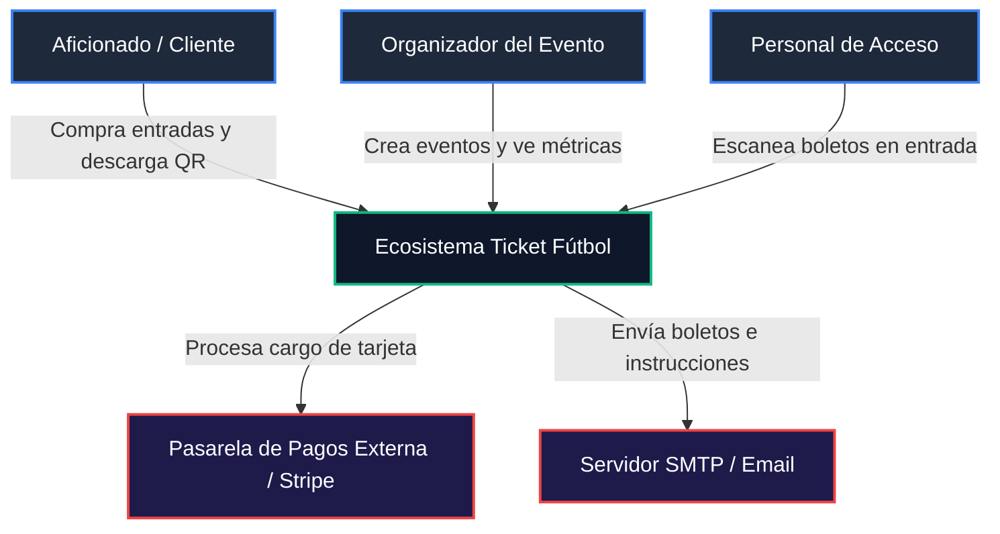
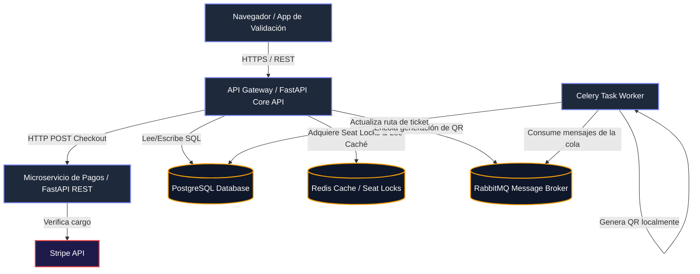
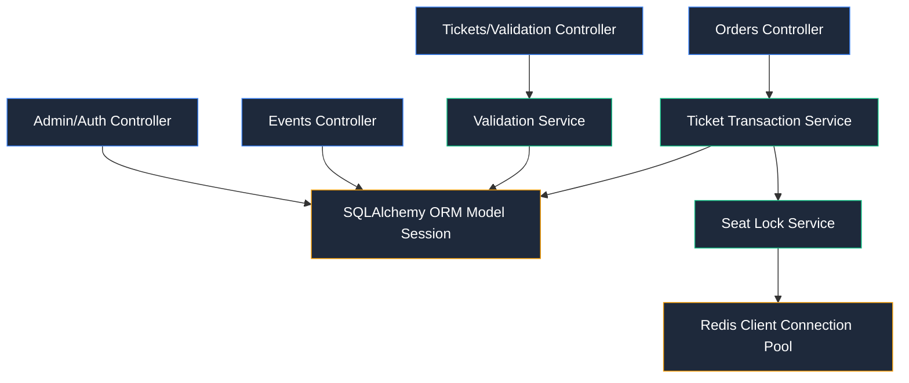
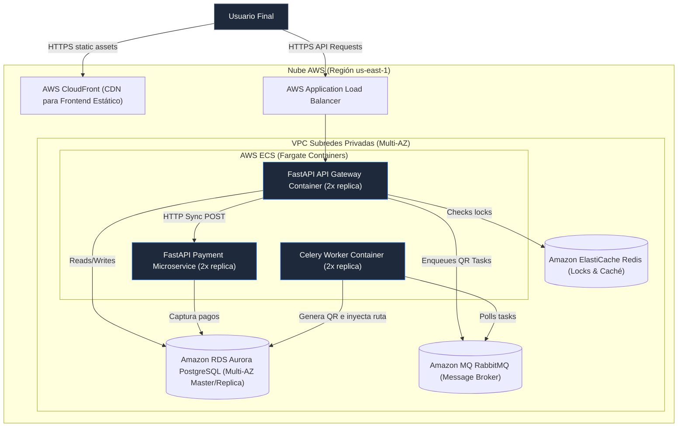

# 🏗️ Documentación de Arquitectura de Software: Ticket Fútbol

Esta documentación detalla los aspectos de diseño, diagramación C4, documentación de APIs y análisis estructurales para la plataforma transaccional de boletos deportivos **Ticket Fútbol**.

---

## 1. Diagramas de Arquitectura (Modelo C4)

### C1: Diagrama de Contexto del Sistema

Representa el ecosistema a alto nivel, los usuarios que interactúan y los sistemas externos.



---

### C2: Diagrama de Contenedores (Arquitectura de Microservicios con RabbitMQ)

Muestra la subdivisión de las aplicaciones que integran el ecosistema, sus almacenes de datos y cómo interactúan.



---

### C3: Diagrama de Componentes (Para API Core)

Muestra la estructura interna de módulos lógicos dentro de la aplicación FastAPI.



---

### C4: Diagrama de Despliegue e Infraestructura (Producción AWS)

Describe la topología de la nube propuesta para desplegar el sistema con alta disponibilidad.



---

## 2. Documentación de APIs (Swagger OpenAPI)

El API se expone con una documentación interactiva Swagger disponible en `/docs`. Los contratos REST principales son:

### 1. Obtener Token de Acceso (OAuth2)

* **Ruta**: `/token`
* **Método**: `POST`
* **Cuerpo (Form-data)**:
  - `username`: Correo del usuario (email).
  - `password`: Contraseña.
* **Respuesta (200 OK)**:
  ```json
  {
    "access_token": "eyJhbGciOiJIUzI1NiIsInR5cCI6IkpXVCJ9...",
    "token_type": "bearer",
    "role": "admin"
  }
  ```

### 2. Crear Evento Deportivo (Admin)

* **Ruta**: `/events`
* **Método**: `POST`
* **Cabecera**: `Authorization: Bearer <JWT_TOKEN>`
* **Cuerpo (JSON)**:
  ```json
  {
    "title": "Liga Deportiva Universitaria vs Barcelona SC",
    "description": "Final de la Liga Pro",
    "date": "2026-07-20T19:00:00",
    "location": "Estadio Rodrigo Paz Delgado",
    "ticket_price": 25.0,
    "total_seats": 50
  }
  ```
* **Respuesta (201 Created)**: Crea el evento y genera automáticamente los 50 asientos en la base de datos (Ej: A1, A2... E10).

### 3. Crear Órdenes (Lock en Redis)

* **Ruta**: `/orders`
* **Método**: `POST`
* **Cabecera**: `Authorization: Bearer <JWT_TOKEN>`
* **Cuerpo (JSON)**:
  ```json
  {
    "event_id": 1,
    "seat_ids": [12, 13]
  }
  ```
* **Comportamiento**: Llama al `SeatLockService` que ejecuta un `SETNX` en Redis para cada asiento por un TTL de 300 segundos. Si tiene éxito, crea la orden en estado `PENDING` y cambia el estado en DB a `LOCKED`.

### 4. Completar Pago de Orden (Checkout vía HTTP al Microservicio de Pagos)

* **Ruta**: `/orders/{order_id}/checkout`
* **Método**: `POST`
* **Cabecera**: `Authorization: Bearer <JWT_TOKEN>`
* **Cuerpo (JSON)**:
  ```json
  {
    "order_id": 1,
    "card_number": "4000123456789010",
    "exp_month": 12,
    "exp_year": 2028,
    "cvc": "123"
  }
  ```
* **Comportamiento**: Envía la solicitud HTTP POST al microservicio de pagos (`ticket_payment_service` en puerto 8001). Si se confirma el cargo:
  - Cambia orden a `PAID`.
  - Cambia asientos a `BOOKED`.
  - Registra boletos con un UUID único en PostgreSQL.
  - Encola la tarea en **RabbitMQ** para la generación asíncrona de códigos QR mediante Celery.
  - Libera el bloqueo en Redis.

### 5. Validación del Boleto (Scan)

* **Ruta**: `/validate/{ticket_uuid}` (para cámaras web/móvil) o `/validate-json/{ticket_uuid}` (para APIs)
* **Método**: `GET` / `POST`
* **Comportamiento**: Compara el UUID, cambia el campo `is_validated` a `True` en DB, registra la marca de tiempo de validación y retorna respuesta visual o JSON. Controla doble entrada alertando error de seguridad.

---

## 3. Cumplimiento Exhaustivo de Principios Arquitectónicos (Los 12 Principios de Diseño)

| Rúbrica / Rango | Principio de Diseño | Implementación en la Arquitectura de Ticket Fútbol |
| :--- | :--- | :--- |
| **SI** | **1. N+1 Design** | Se cuenta con redundancia activa a nivel de infraestructura: el balanceador de carga distribuye el tráfico entre al menos 2 réplicas del API Gateway, los workers de Celery se escalan de forma independiente (mínimo 2 réplicas), y la base de datos Amazon RDS Aurora posee una instancia secundaria (réplica de lectura/failover) activa en otra zona de disponibilidad (Multi-AZ). |
| **SI** | **3. Design to Be Disabled** | El sistema es tolerante a fallos en componentes externos y se degrada de forma elegante. Si el microservicio de pagos falla, el `PaymentProcessorService` captura la excepción HTTP de conexión y recurre automáticamente a un handler local in-process para continuar la simulación sin tirar el flujo principal. Asimismo, si Redis falla, el control de locks cae a un mecanismo de timeout directamente en PostgreSQL para evitar bloqueos eternos. |
| **OPCIONAL** | **4. Design to Be Monitored** | El microservicio de pagos expone un panel visual de telemetría inyectado en su Swagger UI. Este panel lee del endpoint `/telemetry` datos clave como RPM (solicitudes por minuto), latencias medias y máximas, y estados de llamadas. Adicionalmente, el API Gateway cuenta con logs estructurados formateados en JSON y un endpoint `/metrics` en formato Prometheus para alimentar tableros de Grafana. |
| **NA** | **5. Design for Multiple Live Sites** | El sistema es 100% stateless (autenticación vía JWT firmados digitalmente, sin dependencias de sesiones en memoria local de servidor), lo que lo hace nativamente preparado para operar en múltiples sitios geográficos activos simultáneamente mediante balanceo DNS (Geoproximity/Geolocation Routing). |
| **SI** | **6. Use Mature Technologies** | Se han seleccionado tecnologías de gran madurez, con amplias comunidades y soporte corporativo: Python 3.10, FastAPI para endpoints de alta velocidad, PostgreSQL para transaccionalidad ACID rígida, Redis como almacén clave-valor in-memory ultrarápido, y RabbitMQ como bróker AMQP robusto. |
| **SI** | **7. Asynchronous Design** | La arquitectura separa las llamadas transaccionales críticas (que necesitan respuesta síncrona en milisegundos) de los procesos pesados. El API Gateway completa el pago y de inmediato publica un evento de ticket en **RabbitMQ** para que el Celery Worker genere el código QR en segundo plano de manera no bloqueante. |
| **SI** | **9. Scale Out Not Up** | El sistema crece de forma horizontal (Scale Out). Al ser stateless, para soportar un pico transaccional se agregan contenedores económicos en AWS Fargate de forma elástica, en lugar de recurrir a escalado vertical con hardware costoso. |
| **SI** | **10. Two Axes of Scale** | El diseño contempla el eje X (Clonación: múltiples réplicas de los contenedores de la API y de Celery detrás de balanceadores de carga) y el eje Y (Descomposición Funcional: separación de responsabilidades en la API Gateway, el procesador de colas Celery/RabbitMQ, y el Microservicio de pagos). |
| **SI** | **11. Buy when non core** | Enfocado en el núcleo de negocio (gestión deportiva de asientos y validaciones de acceso). Componentes ajenos como pasarelas de pago se "compran/integran" (Stripe) y el envío de emails se delega a servicios especializados (SMTP/SendGrid), optimizando el desarrollo. |
| **SI** | **12. Commodity Hardware** | La arquitectura es independiente de hardware especializado. Todo el sistema corre dentro de contenedores Docker estándar Linux con recursos mínimos asignados (0.5 vCPU y 1GB RAM), permitiendo su despliegue en cualquier servidor VPS estándar o instancia EC2. |

---

## 4. Análisis de Principios Operacionales

### Escalabilidad (Alto)
El rendimiento de las consultas y la carga web escala de forma lineal. Al aislar las escrituras pesadas de Base de Datos y la generación de imágenes QR en la cola RabbitMQ, la API Gateway mantiene latencias bajas (<50ms). El uso de réplicas de lectura de PostgreSQL (Aurora Read Replicas) y cachés en Redis maximiza el volumen de usuarios concurrentes (soportando picos de 5,000 compras concurrentes y hasta 150,000 MAU proyectados a 3 años).

### Disponibilidad (Alto)
Objetivo de SLA transaccional del **99.95%**. Esto se logra gracias al despliegue Multi-AZ, failover automático en la base de datos en menos de 30 segundos, persistencia y durabilidad de mensajes en las colas de RabbitMQ, y políticas de reinicio automático (`restart: always`) de los contenedores de Docker.

### Mantenibilidad (Alto)
El backend respeta de forma estricta los principios **SOLID**:
1. **Single Responsibility (SRP)**: División clara entre enrutadores (`routes/`), controladores de negocio (`services/`), persistencia ORM (`models/`) y tareas en segundo plano (`tasks/`).
2. **Inyección de Dependencias**: Acoplamiento débil facilitado por el sistema `Depends` de FastAPI.
3. **Mapeo Claro**: Menos de 48 horas requeridas para agregar nuevas reglas o cambiar proveedores gracias al desacoplamiento en las clases de servicio.

### Seguridad (Bajo - Evaluación Básica)
1. **Autenticación y Autorización**: Control de acceso basado en roles (**RBAC**) mediante JWT firmado con algoritmo HMAC-SHA256 (`RoleChecker`). Roles definidos: `client` (cliente), `staff` (personal de acceso) y `admin` (organizador).
2. **Doble Entrada**: Prevención activa de fraude o error humano mediante control estricto de estado del boleto (`is_validated` cambia a True en la primera lectura, marcando error e informando "ALREADY_USED" en intentos posteriores).
3. **Cifrado**: Contraseñas de usuarios protegidas mediante hash robusto `bcrypt` en base de datos.

### Fiabilidad (Alto)
Evita condiciones de carrera ("Doble Venta") en compras masivas y concurrentes de asientos de estadios populares. Al solicitar asientos, el sistema adquiere cierres atómicos distribuidos en Redis (`SET key owner NX EX 300`). Si el bloqueo tiene éxito, el asiento entra a estado temporal `LOCKED`. Al consolidar la venta final, se utiliza un nivel de aislamiento de base de datos `READ COMMITTED` con confirmación transaccional rígida.

### Administrabilidad (Alto)
Soporta monitoreo y logs centralizados. A través del monitor de telemetría HTTP en tiempo real integrado en el Microservicio de Pagos y el almacenamiento de logs estructurados en JSON, los administradores pueden realizar auditorías de transacciones en milisegundos. Las copias de seguridad de la base de datos se ejecutan a diario en AWS S3.

### Resiliencia (Alto)
Capacidad de autorecuperación. Si se cae un contenedor (como el worker de Celery), al levantarse nuevamente retoma los mensajes acumulados en la cola persistente de **RabbitMQ** sin pérdida de información. Los pools de conexión a PostgreSQL poseen reconexión y reintentos automatizados.

### Latencia (Alto)
Time to First Byte (TTFB) menor a 50ms para operaciones comunes. Esto se logra gracias a:
1. **Locks Distribuidos en Redis** que evitan golpear la base de datos relacional PostgreSQL con lecturas innecesarias de comprobación.
2. **Eventos Asíncronos**: Generar un código QR demora ~1.2 segundos; delegarlo a la cola RabbitMQ permite responder al usuario de forma inmediata en <40ms.

### Teorema de CAP
- **Para Consulta de Asientos y Estados**: Se prioriza **AP** (Disponibilidad y Tolerancia a Particiones). El mapa de asientos se cachea en Redis y se lee rápidamente; si hay inconsistencias menores de milisegundos, se resuelven en la transacción final.
- **Para Compra / Reserva**: Se prioriza **CP** (Consistencia y Tolerancia a Particiones). Se utiliza el lock en Redis y transacciones ACID en PostgreSQL para asegurar que bajo ninguna partición de red ocurra una doble asignación de un asiento.

---

## 5. Arquitectura del Proyecto (Consolidación)

El ecosistema está compuesto por **3 aplicaciones principales** e independientes operando sobre **Docker Compose**:

```
                       [ Navegador Web Client / Staff ]
                                      │
                                (HTTPS/REST)
                                      ▼
                        ┌──────────────────────────┐
                        │    ticket_api_gateway    │ (Aplicación 1)
                        └──────────┬────┬──────────┘
                                   │    │
                     (HTTP REST)   │    │ (Mensaje AMQP)
             ┌─────────────────────┘    └───────────────────────┐
             ▼                                                  ▼
┌─────────────────────────┐                            ┌─────────────────┐
│  ticket_payment_service │ (Aplicación 2)             │ ticket_rabbitmq │
└─────────────────────────┘                            └────────┬────────┘
                                                                │
                                                        (Consumo de Colas)
                                                                ▼
                                                       ┌──────────────────┐
                                                       │  celery_worker   │ (Aplicación 3)
                                                       └──────────────────┘
```

1. **ticket_api_gateway** (FastAPI, Puerto 8000): Puerta de enlace que sirve el frontend y expone la API RESTful.
2. **ticket_payment_service** (FastAPI, Puerto 8001): Microservicio especializado en pagos y telemetría de red.
3. **ticket_celery_worker** (Celery Worker): Aplicación de fondo para procesamiento asíncrono de colas, conectada a `ticket_rabbitmq` y `ticket_redis` para generar las imágenes QR.
4. **ticket_db** (PostgreSQL 15): Base de datos persistente transaccional.
5. **ticket_redis** (Redis): Almacén de locks distribuidos y caché.
6. **ticket_rabbitmq** (RabbitMQ): Gestor y bróker de colas para comunicación asíncrona.
