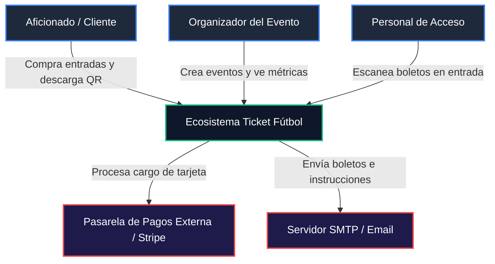
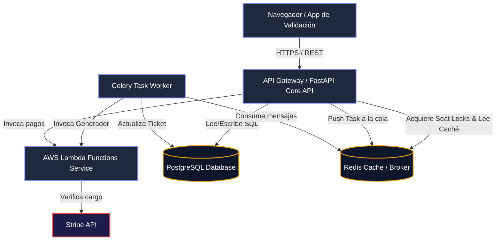
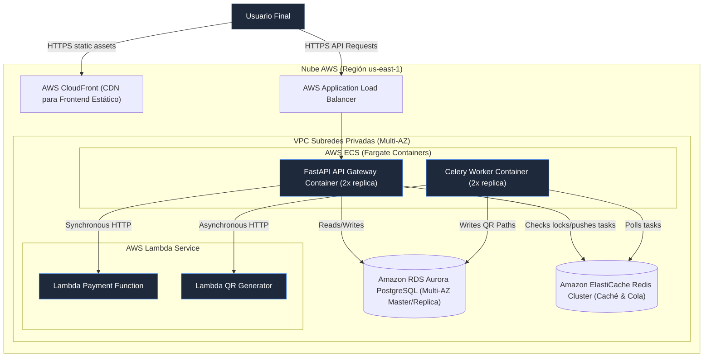

# 🏗️ Documentación de Arquitectura de Software: Ticket Fútbol

Esta documentación detalla los aspectos de diseño, diagramación C4, documentación de APIs y análisis estructurales para la plataforma transaccional de boletos deportivos **Ticket Fútbol**.

---

## 1. Diagramas de Arquitectura (Modelo C4)

### C1: Diagrama de Contexto del Sistema
Representa el ecosistema a alto nivel, los usuarios que interactúan y los sistemas externos.



---

### C2: Diagrama de Contenedores
Muestra la subdivisión de las aplicaciones que integran el ecosistema, sus bases de datos y cómo interactúan.



---

### C3: Diagrama de Componentes (Para API Core)
Muestra la estructura interna de módulos lógicos dentro de la aplicación FastAPI.

```mermaid
graph DP
    classDef router fill:#1E293B,stroke:#3B82F6,color:#FFF;
    classDef service fill:#1E293B,stroke:#10B981,color:#FFF;
    classDef repo fill:#1E293B,stroke:#F59E0B,color:#FFF;

    AuthRouter[Admin/Auth Controller]:::router
    EventRouter[Events Controller]:::router
    OrderRouter[Orders Controller]:::router
    TicketRouter[Tickets/Validation Controller]:::router

    TicketService[Ticket Transaction Service]:::service
    LockService[Seat Lock Service]:::service
    ValidationService[Validation Service]:::service

    SQLAlchemy[SQLAlchemy ORM Model Session]:::repo
    RedisClient[Redis Client Connection Pool]:::repo

    AuthRouter --> SQLAlchemy
    EventRouter --> SQLAlchemy
    
    OrderRouter --> TicketService
    TicketService --> LockService
    TicketService --> SQLAlchemy
    
    LockService --> RedisClient
    TicketRouter --> ValidationService
    ValidationService --> SQLAlchemy
```

---

### C4: Diagrama de Despliegue e Infraestructura (Producción AWS)
Describe la topología de la nube propuesta para desplegar el sistema con alta disponibilidad.



---

## 2. Documentación de APIs (Swagger OpenAPI)

El API se expone con una documentación interactiva Swagger disponible en `/docs`. Los contratos REST principales son:

### 1. Obtener Token de Acceso (OAuth2)
* **Ruta**: `/token`
* **Método**: `POST`
* **Cuerpo (Form-data)**:
  - `username`: Correo del usuario (email).
  - `password`: Contraseña.
* **Respuesta (200 OK)**:
  ```json
  {
    "access_token": "eyJhbGciOiJIUzI1NiIsInR5cCI6IkpXVCJ9...",
    "token_type": "bearer",
    "role": "admin"
  }
  ```

### 2. Crear Evento Deportivo (Admin)
* **Ruta**: `/events`
* **Método**: `POST`
* **Cabecera**: `Authorization: Bearer <JWT_TOKEN>`
* **Cuerpo (JSON)**:
  ```json
  {
    "title": "Liga Deportiva Universitaria vs Barcelona SC",
    "description": "Final de la Liga Pro",
    "date": "2026-07-20T19:00:00",
    "location": "Estadio Rodrigo Paz Delgado",
    "ticket_price": 25.0,
    "total_seats": 50
  }
  ```
* **Respuesta (201 Created)**: Crea el evento y genera automáticamente los 50 asientos en la base de datos (Ej: A1, A2... E10).

### 3. Crear Órdenes (Lock en Redis)
* **Ruta**: `/orders`
* **Método**: `POST`
* **Cabecera**: `Authorization: Bearer <JWT_TOKEN>`
* **Cuerpo (JSON)**:
  ```json
  {
    "event_id": 1,
    "seat_ids": [12, 13]
  }
  ```
* **Comportamiento**: Llama al `SeatLockService` que ejecuta un `SETNX` en Redis para cada asiento por un TTL de 300 segundos. Si tiene éxito, crea la orden en estado `PENDING` y cambia el estado en DB a `LOCKED`.

### 4. Completar Pago de Orden (Checkout con Lambda)
* **Ruta**: `/orders/{order_id}/checkout`
* **Método**: `POST`
* **Cabecera**: `Authorization: Bearer <JWT_TOKEN>`
* **Cuerpo (JSON)**:
  ```json
  {
    "order_id": 1,
    "card_number": "4000123456789010",
    "exp_month": 12,
    "exp_year": 2028,
    "cvc": "123"
  }
  ```
* **Comportamiento**: Envía la solicitud al microservicio serverless (simulador Lambda de pagos). Si se confirma el cargo:
  - Cambia orden a `PAID`.
  - Cambia asientos a `BOOKED`.
  - Registra boletos con un UUID único en PostgreSQL.
  - Encola tarea en Celery para la generación asíncrona de códigos QR mediante Lambda.
  - Libera el bloqueo en Redis.

### 5. Validación del Boleto (Scan)
* **Ruta**: `/validate/{ticket_uuid}` (para cámaras web/móvil) o `/validate-json/{ticket_uuid}` (para APIs)
* **Método**: `GET` / `POST`
* **Comportamiento**: Compara el UUID, cambia el campo `is_validated` a `True` en DB, registra la marca de tiempo de validación y retorna respuesta visual o JSON. Controla doble entrada alertando error de seguridad.

---

## 3. Análisis de Atributos Arquitectónicos

### A. Caché
* **Estrategia**: Redis actúa como caché temporal y base de datos clave-valor.
* **Mecanismos**:
  1. Evitación de carga repetitiva en eventos populares guardando mapas de asientos estáticos.
  2. Implementación de **Cache-Aside** para la info detallada de partidos, refrescándose al modificarse un evento.

### B. Balanceo de Carga
* **Estrategia**: Despliegue de un AWS Application Load Balancer (ALB) frente al cluster de ECS Fargate.
* **Algoritmo**: Round Robin con comprobaciones de salud (`Health Checks` en `/docs`) redirigiendo peticiones sólo a instancias activas.
* **Sticky Sessions**: Deshabilitado. El API es 100% *stateless* (sin estado), utilizando JWT firmado para autorizar peticiones, facilitando la escalabilidad horizontal infinita.

### C. Indexación de Base de Datos
* **Estrategia**: Creación de índices B-Tree específicos en PostgreSQL para optimizar consultas críticas de alta concurrencia.
* **Índices Implementados**:
  1. `tickets(ticket_uuid)`: Indexado único. Permite al personal de accesos escanear y validar boletos en milisegundos.
  2. `seats(event_id, status)`: Índice compuesto para acelerar el renderizado del mapa de asientos.
  3. `orders(user_id)` y `orders(event_id)`: Agilizan búsquedas históricas y auditorías transaccionales.

### D. Redundancia
* **Estrategia**: Diseño libre de puntos únicos de fallo (SPOF).
* **Capas**:
  - **Base de datos**: Amazon Aurora PostgreSQL con una réplica de lectura activa en una zona de disponibilidad (AZ) distinta. Conmutación automática (failover) en menos de 30 segundos.
  - **Redis**: ElastiCache Redis con Multi-AZ y Réplicas de Lectura.

### E. Disponibilidad
* **Métrica**: Objetivo de SLA de **99.95%** de disponibilidad anual.
* **Estrategias**:
  - Auto-escalado de contenedores (mínimo 2 réplicas por servicio corriendo en diferentes subredes AZ).
  - Respaldos diarios automatizados (Snapshots) de PostgreSQL en AWS S3 con retención de 30 días.

### F. Concurrencia
* **Estrategia**: Prevención del problema de la "Doble Venta" (Race Conditions al reservar el mismo asiento).
* **Solución**: **Distributed Locks (Cierres Distribuidos)** con Redis.
  - Al seleccionar un asiento, el API realiza un `SET lock:seat:{seat_id} user_id NX EX 300`.
  - Si otra petición entra para el mismo `seat_id`, Redis rechaza de forma atómica.
  - Se utiliza una transacción interna de base de datos (`isolation_level="READ COMMITTED"`) al consolidar la venta final.

### G. Latencia
* **Estrategia**: Minimizar el tiempo de respuesta del servidor (TTFB < 50ms para operaciones comunes).
* **Solución**:
  - **Procesamiento Asíncrono (Event-Driven)**: La generación de imágenes QR y envío de correos son tareas pesadas (I/O). En lugar de hacer esperar al cliente en la pasarela, se despacha un mensaje a Celery y se retorna respuesta inmediata al cliente.
  - Conexión mediante `Connection Pooling` en PostgreSQL (límite de pool optimizado a 20 conexiones persistentes para evitar latencia de negociación TCP).

### H. Costo y Proyección
* **Proyección de usuarios**: 50,000 usuarios activos mensuales, con picos de 5,000 compras concurrentes durante la venta de partidos importantes.
* **Costo Mensual Estimado en AWS**:
  1. **AWS ECS Fargate** (2 contenedores API + 2 workers Celery, 0.5 vCPU, 1GB RAM c/u): ~$48 USD.
  2. **Amazon Aurora Serverless v2 PostgreSQL**: ~$60 USD.
  3. **Amazon ElastiCache Redis** (cache.t4g.medium): ~$34 USD.
  4. **AWS Lambda** (1 millón de peticiones de pago y QR, memoria 512MB): ~$10 USD.
  5. **AWS Application Load Balancer** + Transferencia de datos: ~$35 USD.
  - **Total Estimado**: **~$187 USD / mes** (altamente económico y elástico).

### I. Performance y Escalabilidad
* **Auto-scaling**: Las tareas del worker Celery pueden escalar horizontalmente de forma independiente si la cola de mensajería Redis crece, sin afectar el rendimiento de la API web que recibe las peticiones principales.

---

## 4. Gestión de Logs, Monitoreo y CI/CD

### A. Gestión de Logs Centralizada
Se diseña el uso del agente **Grafana Loki** en los contenedores.
1. El backend de Python escribe logs formateados en JSON estructural para facilitar la indexación.
2. Cada entrada de log contiene llaves contextuales: `order_id`, `user_id`, `status` y `trace_id`.
3. Permite correlacionar un fallo de pago en el simulador Lambda directamente con la orden cancelada en el core.

### B. Monitoreo
* **Métricas**: Exposición de métricas clave usando el formato de **Prometheus** mediante un endpoint `/metrics`.
* **Dashboards**: Configuración de Grafana para visualizar:
  - Tasa de peticiones por segundo (RPS) y porcentaje de errores HTTP 5xx.
  - Latencia media de respuesta en transacciones de pago.
  - Número de tareas Celery pendientes en la cola Redis (Backlog size).

### C. Pipeline de Integración y Despliegue Continuo (CI/CD)
Diseño de flujo automatizado mediante **GitHub Actions** (`.github/workflows/deploy.yml`):

```yaml
name: CI/CD Pipeline - Ticket Futbol

on:
  push:
    branches: [ main ]

jobs:
  lint-and-test:
    runs-on: ubuntu-latest
    steps:
      - uses: actions/checkout@v3
      - name: Set up Python
        uses: actions/setup-python@v4
        with:
          python-version: '3.10'
      - name: Install dependencies
        run: |
          pip install -r requirements.txt
      - name: Run Linter
        run: flake8 app/ lambda/
      - name: Run Integration Tests
        run: python -m unittest tests/test_flow.py

  build-and-deploy:
    needs: lint-and-test
    runs-on: ubuntu-latest
    steps:
      - uses: actions/checkout@v3
      - name: Configure AWS Credentials
        uses: aws-actions/configure-aws-credentials@v1
        with:
          aws-access-key-id: ${{ secrets.AWS_ACCESS_KEY_ID }}
          aws-secret-access-key: ${{ secrets.AWS_SECRET_ACCESS_KEY }}
          aws-region: us-east-1
      - name: Build and Push Docker Images to ECR
        run: |
          docker build -t ticket-api -f docker/Dockerfile.api .
          docker tag ticket-api:latest ${{ secrets.AWS_ACCOUNT_ID }}.dkr.ecr.us-east-1.amazonaws.com/ticket-api:latest
          docker push ${{ secrets.AWS_ACCOUNT_ID }}.dkr.ecr.us-east-1.amazonaws.com/ticket-api:latest
      - name: Deploy to ECS Task Definition
        run: |
          aws ecs update-service --cluster ticket-cluster --service ticket-api-service --force-new-deployment
```

---

## 5. Principios SOLID, POO y Buenas Prácticas

La base del código de Python se implementa respetando los pilares de la programación orientada a objetos (POO) y buenas prácticas de desarrollo:

1. **Responsabilidad Única (SRP)**:
   - Los controladores en `routes/` solo gestionan peticiones HTTP.
   - Las validaciones y cálculos de transacciones se delegan a las clases en `services/` (ej: `TicketService`, `SeatLockService`).
   - El worker de Celery (`celery_worker.py`) solo se encarga de estructurar el hilo de fondo y procesar encolamientos.
2. **Abierto / Cerrado (OCP)**:
   - Los servicios interactúan mediante interfaces de clientes de Red (como `PaymentProcessorService` que consume HTTP). Si cambiamos a un procesador real, solo extendemos la clase sin alterar la lógica core de órdenes de `TicketService`.
3. **Inyección de Dependencias**:
   - Uso intensivo del sistema `Depends(...)` de FastAPI para inyectar dinámicamente las sesiones de Base de Datos y los objetos de usuarios autenticados con sus respectivos roles autorizados, desacoplando la instanciación de los mismos.
4. **Buenas prácticas Git**:
   - Uso de nombres descriptivos para ramas (`feature/`, `bugfix/`), archivos `.gitignore` configurados, código modular y libre de secretos en el repositorio utilizando inyección por variables de entorno de Docker.
